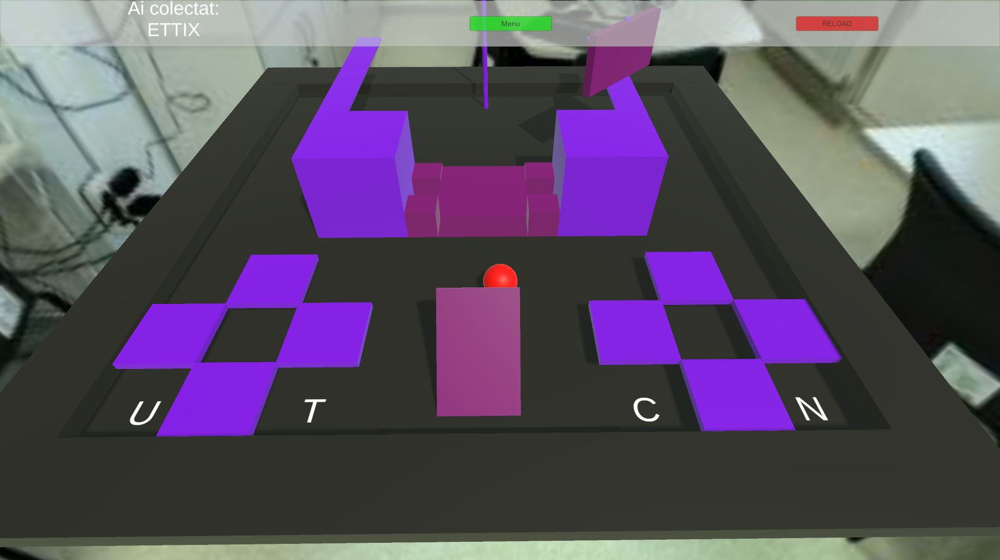

# 🎮 Unity Mini-Game: ETTI Collector (Roll-a-Ball Extension)

This is a custom extension of the classic **"Roll-a-Ball"** Unity tutorial project. The player controls a sphere and must collect letters in the correct order to form **"ETTI"**, while avoiding distractions and dynamically moving obstacles. To play it, download both parts, extract in the same directory and run "My project.exe"

---

## 🕹️ Game Objective

Collect the letters **E → T → T → I** in the correct sequence.

- The game includes **extra letters** to confuse the player (e.g., U, C, N, X).
- If a wrong letter is collected, it has no effect—but wastes time and effort.
- Once all letters in the correct order are collected, the game ends in success.

---

## ⚙️ Features

- ✅ **Dynamic Obstacles**:  
  Some blocks react to the player's position and attempt to block progress using custom scripts.

- ✅ **Camera Control**:  
  Players can rotate the camera to view the scene from different angles.

- ✅ **Movement Independent of Camera**:  
  Player movement is relative to the **world axis**, not the camera. This adds challenge and requires orientation skills.

- ✅ **Pickup Logic**:  
  Letter pickups are programmed to respond only if the collected letter matches the expected one in sequence.

- ✅ **UI Elements**:  
  A text display shows collected letters in order.

---

## 🎨 Visual Elements

- The level is designed in a stylized 3D environment.
- The letters are arranged to form distractions (e.g., **"UTCN"**) around the arena.
- The red ball (player) is at the center, with dynamic obstacles in motion.

---

## 📸 Screenshot & Demo

---

## ✅ How to Play

1. Use the keyboard to move the red sphere.
2. Rotate the camera to observe the letters.
3. Collect the letters **E-T-T-I** in the correct order.
4. Avoid being blocked by reactive obstacles.
5. Complete the sequence to win!

---

## 🧠 Learning Objectives

This project was created to:
- Expand upon the Unity "Roll-a-Ball" tutorial.
- Practice working with custom physics and object interaction.
- Design a more challenging gameplay mechanic using camera-relative decoupling and scripted obstacle logic.

---
This project was developed for the course "Development of Interactive 2D/3D Environments", under the supervision of Professor Aurelia Ciupe.
---
